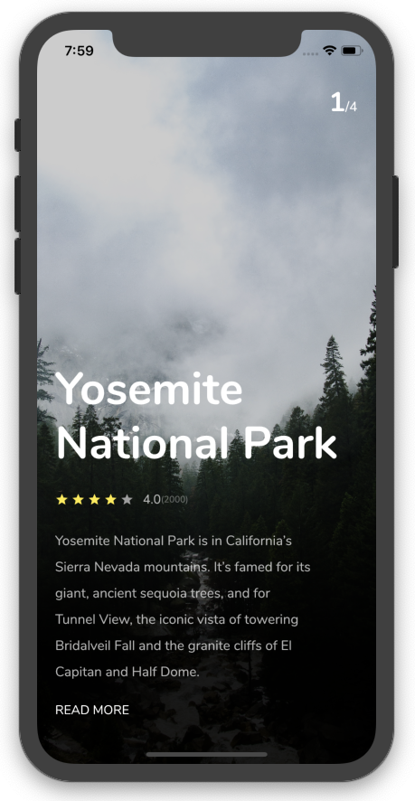
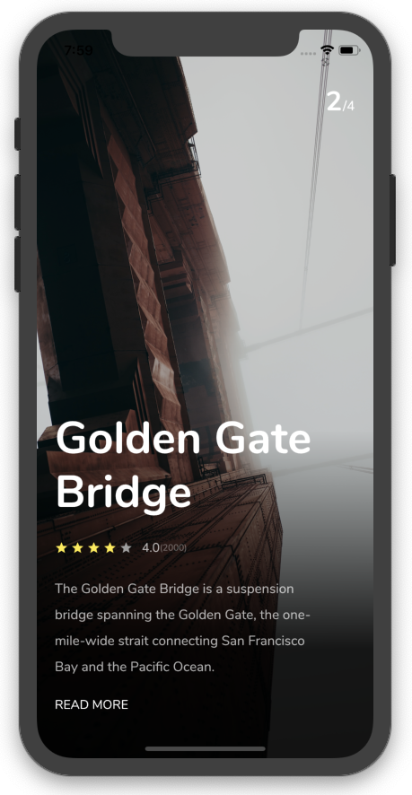

## Flutter Trip Application Design - Day 2

```dart
class Day2 extends Flutter100DaysOfCode {
  video() {
    return {
      "title": "Flutter Trip Application Design",
      "description": "Let's work with PageView and add some animation.",
      "day": 2,
      "videoLink": "https://youtu.be/uqm6U5_bcH0"
    }
  }
}
```

## Development Setup

Clone the repository and run the following commands:

```
flutter pub get
flutter run
```

## ScreenShot


